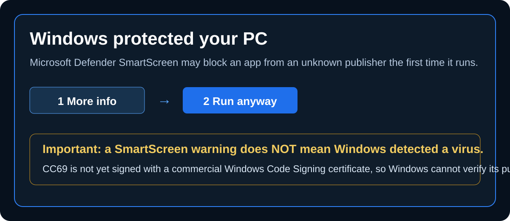

<p align="center"><a href="README.md">繁體中文</a> ｜ <strong>English</strong> ｜ <a href="README.ja.md">日本語</a> ｜ <a href="README.ko.md">한국어</a></p>

<h2 align="center">CC69 Threads Manager</h2>
<p align="center"><strong>Clean up your Threads relationships and see who actually follows back.</strong></p>

<p align="center">
  <a href="https://github.com/R69T/CC69_Threads_Public/releases/latest"><strong>⬇️ Download Latest</strong></a>
  &nbsp; · &nbsp;
  <a href="#-quick-start"><strong>🚀 Quick Start</strong></a>
  &nbsp; · &nbsp;
  <a href="#%EF%B8%8F-windows-smartscreen"><strong>🛡️ Windows Safety</strong></a>
</p>

## ✨ CC69 at a glance

<p align="center"></p>

> **Agreed to follow each other, but your Following and Followers are far apart?** CC69 quickly compares Threads relationships, finds accounts that did not follow back, and makes cleanup easier.

## 🎯 What CC69 does

If you have ever agreed to mutual follows but ended up with Following much higher than Followers, CC69 helps you sort the relationship first:

- 🟠 Accounts you follow that do not follow you back
- 🔴 Followers you have not followed back
- 🟢 Mutual-follow status
- ✅ Select confirmed accounts and unfollow sequentially with visible progress
- 🕒 New-follow protection, default 0 days and user-adjustable
- 📦 Import official Meta / Threads downloaded data when Quick Scan is incomplete
- 🌐 Traditional Chinese / English / Japanese / Korean

### 🙂 A free little bonus

**Mutual Center｜Free Bonus**

A free little extra for everyone. If you are curious, go check it out yourself. Happy mutual follows 🙂

## 🚀 Quick Start

**Sign in → Quick Scan → Review results → Select and clean up**

Quick Scan is limited to **6 runs per rolling 24 hours**.

## ⬇️ Download & Install

Go to **https://github.com/R69T/CC69_Threads_Public/releases/latest**, download `CC69_Threads_Manager_vX.X.X_Windows.zip`, extract it, then run `CC69_Threads_Manager.exe`.

## 🛡️ Windows SmartScreen

<p align="center"></p>

CC69 is currently **not signed with a commercial Windows Code Signing certificate**. Because of that, Windows may show **“Windows protected your PC”** or **“Unknown publisher”** the first time you run it.

> **This SmartScreen screen is not, by itself, a malware detection result.** It means Windows cannot currently verify CC69's publisher through a trusted digital signature / established publisher reputation.

If you downloaded CC69 from this project's official GitHub Releases page:

1. Click **More info**.
2. Confirm the app is `CC69_Threads_Manager.exe`.
3. Click **Run anyway**.

Only download CC69 from the official Releases page. You can also verify the executable with SHA-256:

```powershell
Get-FileHash .\CC69_Threads_Manager.exe -Algorithm SHA256
```

Compare the result with `CC69_Threads_Manager.exe.sha256` included with the release package.

> If Windows Defender or another antivirus separately reports a specific malware detection, treat that as a different warning and investigate it rather than ignoring it.

## 🔐 Login & Privacy

Your Threads / Meta password is entered on the official Threads / Meta login page, not into the CC69 interface.

## 🔎 If Quick Scan is incomplete

Threads Web uses dynamic loading and virtualized lists. CC69 shows `retrieved count / count displayed by Threads`. If the list remains incomplete, use **Full Data Check** and import your official Meta / Threads downloaded relationship data.

## ⏳ Sequential unfollow

CC69 opens and confirms accounts one by one. Larger selections take longer, so please wait and watch the progress indicator.

## ⚠️ Usage Notice

If Threads shows a challenge, restriction, verification prompt, or “try again later” message, stop and retry later.
