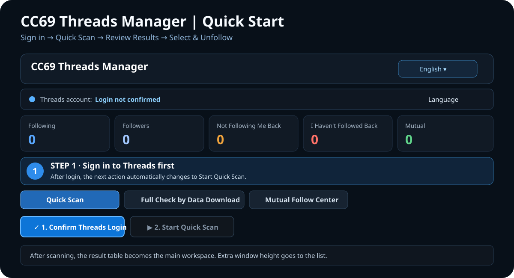

<p align="center"><a href="README.md">繁體中文</a> ｜ <strong>English</strong> ｜ <a href="README.ja.md">日本語</a> ｜ <a href="README.ko.md">한국어</a></p>

<h2 align="center">CC69 Threads Manager</h2>
<p align="center">A clearer Windows desktop workflow for Threads relationships.</p>

<p align="center"><a href="https://github.com/R69T/CC69_Threads_Public/releases/latest"><strong>⬇️ Download Latest</strong></a> · <a href="#-quick-start"><strong>🚀 Quick Start</strong></a> · <a href="#-windows-smartscreen"><strong>🛡️ SmartScreen</strong></a></p>

<p align="center"></p>

## 🚀 Quick Start

| Step | What to do | What happens |
| --- | --- | --- |
| **1. Launch CC69** | Extract the ZIP and run `CC69_Threads_Manager.exe` | First launch prepares local browser/app data. |
| **2. Confirm Threads login** | Press the blue login button | Complete login on the official Threads / Meta page. |
| **3. Start Quick Scan** | After login, the green scan button becomes the next primary action | Progress shows Followers / Following counts as they are retrieved. |
| **4. Review results** | Use the five summary cards and the table below | Following, Followers, non-followers, accounts you have not followed back, Mutual. |
| **5. Manage accounts** | Select confirmed rows and unfollow if needed | CC69 processes accounts sequentially and shows progress. |

**The first-use rule is simple: sign in first, then scan.**

## ✨ Main Features

- 🔎 Quick Scan of Threads Followers / Following
- 🟠 Find accounts that do not follow you back
- 🔴 Find followers you have not followed back
- 🟢 Mutual-follow status
- ✅ Sequential unfollow with visible progress
- 🕒 New-follow protection
- 📦 Import official Meta / Threads downloaded data for a more complete comparison
- 🤝 Mutual Follow Center Beta
- 🌐 Traditional Chinese / English / Japanese / Korean

Quick Scan is limited to **6 runs per rolling 24 hours**.

## 🌐 Languages

On first launch, CC69 chooses the UI language from Windows automatically:

- Chinese Windows → Traditional Chinese
- Japanese Windows → Japanese
- Korean Windows → Korean
- Other languages → English

You can change it at the top of the app at any time.

## ⬇️ Download & Install

Go to **https://github.com/R69T/CC69_Threads_Public/releases/latest** and download:

`CC69_Threads_Manager_vX.X.X_Windows.zip`

Extract it, then run `CC69_Threads_Manager.exe`.

## 🛡️ Windows SmartScreen

CC69 is **not currently signed with a commercial Windows code-signing certificate**, so SmartScreen may show “Windows protected your PC” or “Unknown publisher.”

**That warning by itself does not mean Windows detected a virus.** It means Windows cannot currently verify a publisher signature/reputation for the EXE.

Only download from the official Releases page:

**https://github.com/R69T/CC69_Threads_Public/releases**

Verify the EXE hash in PowerShell if desired:

```powershell
Get-FileHash .\CC69_Threads_Manager.exe -Algorithm SHA256
```

Compare it with `CC69_Threads_Manager.exe.sha256` inside the ZIP.

## 🔐 Login & Privacy

Your Threads / Meta password is entered on the **official Threads / Meta login page**, not into the CC69 interface.

If Threads asks to save login information after the first login, CC69 attempts to complete that step so the browser session can be reused later.

## 🔎 If Quick Scan is incomplete

Threads Web uses dynamic loading and virtualized lists. CC69 shows:

`retrieved count / count displayed by Threads`

If Quick Scan remains incomplete, switch to **Full Check by Data Download** and import your official Meta / Threads downloaded relationship data.

## 🤝 Mutual Follow Center Beta

Participation is voluntary. CC69 can match participating accounts and keep minimal pairing state. This feature is still in beta.

## ⚠️ Usage Notice

Threads can change its web structure and platform limits at any time. If Threads shows a challenge, restriction, or “try again later” message, stop and retry later.

CC69 does not guarantee that any particular action frequency will avoid platform restrictions.