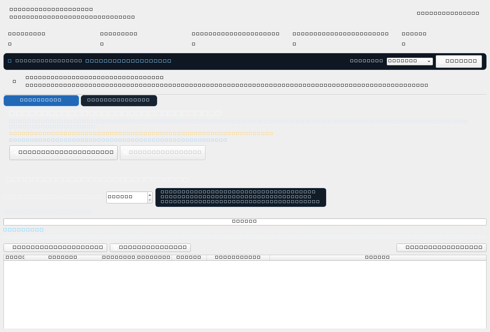

<p align="center"><a href="README.md">繁體中文</a> ｜ <strong>English</strong> ｜ <a href="README.ja.md">日本語</a> ｜ <a href="README.ko.md">한국어</a></p>

<h2 align="center">CC69 Threads Manager</h2>
<p align="center"><strong>Clean up your Threads relationships and see who actually follows back.</strong></p>

<p align="center"><a href="https://github.com/R69T/CC69_Threads_Public/releases/latest"><strong>⬇️ Download Latest</strong></a></p>

## 🖥️ Real App Interface

<p align="center"></p>

> This screenshot is captured from the actual CC69 app by GitHub Actions. It is not a redrawn mockup.

## 🎯 What CC69 does

If you have ever agreed to mutual follows but ended up with Following much higher than Followers, CC69 helps you sort the relationship first:

- 🟠 Accounts you follow that do not follow you back
- 🔴 Followers you have not followed back
- 🟢 Mutual-follow status
- ✅ Select confirmed accounts and unfollow sequentially with visible progress
- 🕒 New-follow protection, default 0 days and user-adjustable
- 📦 Import official Meta / Threads downloaded data when Quick Scan is incomplete
- 🌐 Traditional Chinese / English / Japanese / Korean

### 🙂 A small beta surprise

**Mutual Center｜Beta**

The more people participate, the more interesting it becomes. Explore it yourself 🙂

## 🚀 Quick Start

**Sign in → Quick Scan → Review results → Select and clean up**

Quick Scan is limited to **6 runs per rolling 24 hours**.

## ⬇️ Download & Install

Go to **https://github.com/R69T/CC69_Threads_Public/releases/latest**, download `CC69_Threads_Manager_vX.X.X_Windows.zip`, extract it, then run `CC69_Threads_Manager.exe`.

## 🛡️ Windows SmartScreen

CC69 is not currently signed with a commercial Windows code-signing certificate, so SmartScreen may show “Windows protected your PC” or “Unknown publisher.”

**That warning by itself does not mean Windows detected a virus.** Only download from the official GitHub Releases page and verify SHA-256 if desired.

```powershell
Get-FileHash .\CC69_Threads_Manager.exe -Algorithm SHA256
```

## 🔐 Login & Privacy

Your Threads / Meta password is entered on the official Threads / Meta login page, not into the CC69 interface.

## 🔎 If Quick Scan is incomplete

Threads Web uses dynamic loading and virtualized lists. CC69 shows `retrieved count / count displayed by Threads`. If the list remains incomplete, use **Full Data Check** and import your official Meta / Threads downloaded relationship data.

## ⏳ Sequential unfollow

CC69 opens and confirms accounts one by one. Larger selections take longer, so please wait and watch the progress indicator.

## ⚠️ Usage Notice

If Threads shows a challenge, restriction, verification prompt, or “try again later” message, stop and retry later.
