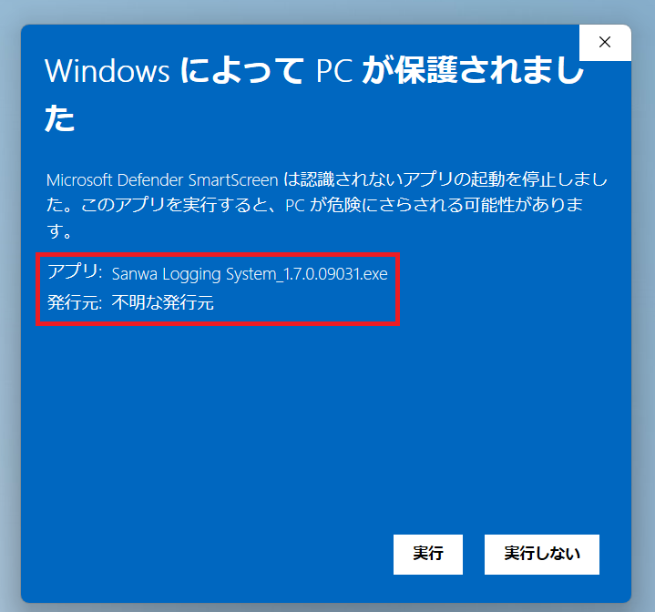

<p align="center"><a href="README.md">繁體中文</a> ｜ <a href="README.en.md">English</a> ｜ <strong>日本語</strong> ｜ <a href="README.ko.md">한국어</a></p>

<h2 align="center">CC69 Threads Manager</h2>
<p align="center"><strong>Threads のフォロー関係を見やすく整理。</strong></p>

<p align="center">
  <a href="https://github.com/R69T/CC69_Threads_Public/releases/latest"><strong>⬇️ 最新版をダウンロード</strong></a>
  &nbsp; · &nbsp;
  <a href="#-クイックスタート"><strong>🚀 クイックスタート</strong></a>
  &nbsp; · &nbsp;
  <a href="#windows-smartscreen"><strong>🛡️ Windows 安全案内</strong></a>
</p>

## ✨ CC69 の機能紹介

<p align="center"></p>

> **相互フォローのはずなのに、フォロー数とフォロワー数の差が大きい？** CC69 が Threads のフォロー関係をすばやく比較し、フォローバックされていないアカウントを見つけて、整理・解除をラクにします。

## 🎯 CC69 でできること

相互フォローの約束をしたのに、いつの間にか Following が Followers より大幅に増えてしまった場合、CC69 でまず関係を整理できます。

- 🟠 自分はフォローしているが、相手はフォローバックしていない
- 🔴 相手はフォローしているが、自分がまだフォロー返ししていない
- 🟢 相互フォロー状態
- ✅ 確認済みアカウントを選択し、進捗を表示しながら順番にフォロー解除
- 🕒 新規フォロー保護：初期値 0 日、自由に変更可能
- 📦 クイックスキャンが不完全な場合は Meta / Threads 公式ダウンロードデータを読み込み
- 🌐 繁體中文 / English / 日本語 / 한국어

### 🙂 無料のおまけ

**相互フォローセンター｜無料のおまけ**

みんな向けの無料の小機能です。気になる方は自分で見てみてください。楽しい相互フォローを 🙂

## 🚀 クイックスタート

**ログイン → クイックスキャン → 結果確認 → 選択して整理**

クイックスキャンは **24時間のローリング期間で最大6回**です。

## ⬇️ ダウンロードとインストール

**https://github.com/R69T/CC69_Threads_Public/releases/latest** から `CC69_Threads_Manager_vX.X.X_Windows.zip` をダウンロードし、展開後 `CC69_Threads_Manager.exe` を実行してください。

<a id="windows-smartscreen"></a>
## 🛡️ Windows SmartScreen｜初回起動前にご確認ください

<p align="center"></p>

上の画像は、CC69 を初めて起動したときに**実際に表示される場合がある Microsoft Defender SmartScreen 画面**です。次のような表示が出ることがあります。

- **「Windows によって PC が保護されました」**
- アプリ：`CC69_Threads_Manager.exe`
- 発行元：**不明な発行元 / Unknown publisher**

### なぜこの画面が表示されるのですか？

CC69 は現在、**商用 Windows Code Signing 証明書を使用していません**。そのため Windows は、信頼済みのデジタル署名から発行元を確認できません。また、アプリの SmartScreen 評判がまだ十分に蓄積されていない場合にも警告が表示されることがあります。

> **重要：この SmartScreen の「不明な発行元」画面だけで、Windows が CC69 をウイルスとして検出したという意味ではありません。**
>
> 主に「商用コード署名証明書／既存の発行元評価で、この EXE の発行元を Windows が確認できない」という意味です。

### 公式 GitHub Releases からダウンロードした場合

まず、このプロジェクトの公式 Releases からダウンロードしたことと、Windows 画面に表示されているアプリ名が次の通りであることを確認してください。

`CC69_Threads_Manager.exe`

Windows が最初に **「実行しない」** だけを表示する SmartScreen 画面を出した場合：

1. **「詳細情報」**をクリック
2. アプリ名が `CC69_Threads_Manager.exe` であることを確認
3. **「実行」／「実行する」**に相当する選択肢が表示されたら、自分で確認したうえで実行するか判断してください

### ファイルをさらに確認したい場合：SHA-256

PowerShell で次を実行します。

```powershell
Get-FileHash .\CC69_Threads_Manager.exe -Algorithm SHA256
```

その結果を Release ZIP に含まれる：

`CC69_Threads_Manager.exe.sha256`

と比較してください。値が一致すれば、手元の EXE がその Release で配布されたファイルと一致していることを確認できます。

### SmartScreen と実際のウイルス検出は別です

Windows Defender や別のウイルス対策ソフトが、SmartScreen とは別に **具体的なマルウェア名、Trojan、Malware、PUA などの検出結果**を表示した場合は、単なる「不明な発行元」警告とは異なります。その場合は無視せず、配布元とファイルを別途確認してください。

**CC69 は、このプロジェクトの公式 GitHub Releases からのみダウンロードすることをおすすめします。**

## 🔐 ログインとプライバシー

Threads / Meta のパスワードは公式ログインページで入力します。CC69 自体の画面にパスワードを入力する方式ではありません。

## 🔎 クイックスキャンが不完全な場合

Threads Web は動的ロードと仮想リストを使用しています。不完全な場合は **完全データ確認** に切り替え、Meta / Threads 公式ダウンロードデータを読み込んでください。

## ⏳ フォロー解除について

CC69 はアカウントを1件ずつ開いて確認するため、選択数が多いほど時間がかかります。開始後は進捗を確認しながらお待ちください。

## ⚠️ 使用上の注意

Threads に認証、制限、「後でもう一度お試しください」などが表示された場合は操作を停止し、時間を置いて再試行してください。