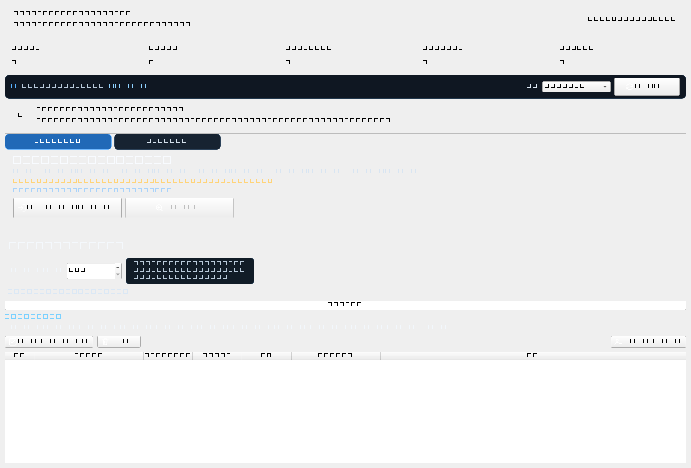

<p align="center"><a href="README.md">繁體中文</a> ｜ <a href="README.en.md">English</a> ｜ <strong>日本語</strong> ｜ <a href="README.ko.md">한국어</a></p>

<h2 align="center">CC69 Threads Manager</h2>
<p align="center"><strong>Threads のフォロー関係を見やすく整理。</strong></p>

<p align="center"><a href="https://github.com/R69T/CC69_Threads_Public/releases/latest"><strong>⬇️ 最新版をダウンロード</strong></a></p>

## 🖥️ 実際のアプリ画面

<p align="center"></p>

> この画像は GitHub Actions が実際の CC69 アプリを起動して取得するスクリーンショットです。描き直したモックアップではありません。

## 🎯 CC69 でできること

相互フォローの約束をしたのに、いつの間にか Following が Followers より大幅に増えてしまった場合、CC69 でまず関係を整理できます。

- 🟠 自分はフォローしているが、相手はフォローバックしていない
- 🔴 相手はフォローしているが、自分がまだフォロー返ししていない
- 🟢 相互フォロー状態
- ✅ 確認済みアカウントを選択し、進捗を表示しながら順番にフォロー解除
- 🕒 新規フォロー保護：初期値 0 日、自由に変更可能
- 📦 クイックスキャンが不完全な場合は Meta / Threads 公式ダウンロードデータを読み込み
- 🌐 繁體中文 / English / 日本語 / 한국어

### 🙂 ベータ版の小さな仕掛け

**相互フォローセンター｜Beta**

参加者が増えるほど、ちょっと面白くなるかもしれません。詳しくは自分で探してみてください 🙂

## 🚀 クイックスタート

**ログイン → クイックスキャン → 結果確認 → 選択して整理**

クイックスキャンは **24時間のローリング期間で最大6回**です。

## ⬇️ ダウンロードとインストール

**https://github.com/R69T/CC69_Threads_Public/releases/latest** から `CC69_Threads_Manager_vX.X.X_Windows.zip` をダウンロードし、展開後 `CC69_Threads_Manager.exe` を実行してください。

## 🛡️ Windows SmartScreen

CC69 は現在、商用 Windows コード署名証明書で署名されていないため、「Windows によって PC が保護されました」「不明な発行元」などが表示される場合があります。

**この警告だけでウイルスが検出されたという意味ではありません。** 必ず公式 GitHub Releases からダウンロードしてください。

```powershell
Get-FileHash .\CC69_Threads_Manager.exe -Algorithm SHA256
```

## 🔐 ログインとプライバシー

Threads / Meta のパスワードは公式ログインページで入力します。CC69 自体の画面にパスワードを入力する方式ではありません。

## 🔎 クイックスキャンが不完全な場合

Threads Web は動的ロードと仮想リストを使用しています。不完全な場合は **完全データ確認** に切り替え、Meta / Threads 公式ダウンロードデータを読み込んでください。

## ⏳ フォロー解除について

CC69 はアカウントを1件ずつ開いて確認するため、選択数が多いほど時間がかかります。開始後は進捗を確認しながらお待ちください。

## ⚠️ 使用上の注意

Threads に認証、制限、「後でもう一度お試しください」などが表示された場合は操作を停止し、時間を置いて再試行してください。
