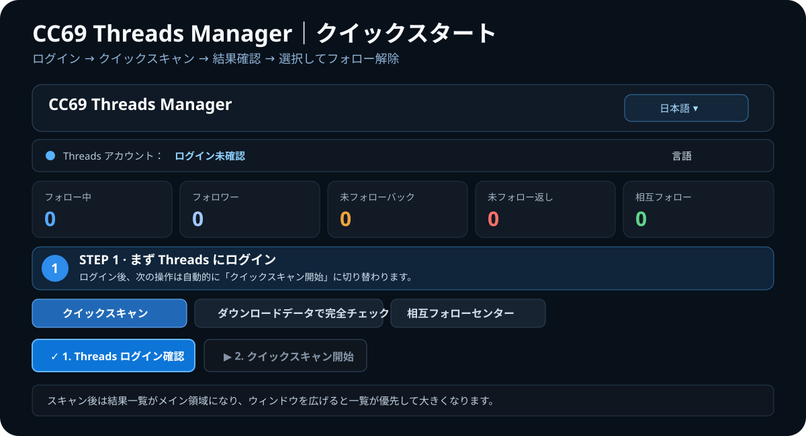

<p align="center"><a href="README.md">繁體中文</a> ｜ <a href="README.en.md">English</a> ｜ <strong>日本語</strong> ｜ <a href="README.ko.md">한국어</a></p>

<h2 align="center">CC69 Threads Manager</h2>
<p align="center">Threads のフォロー関係を分かりやすく整理する Windows デスクトップアプリ。</p>

<p align="center"><a href="https://github.com/R69T/CC69_Threads_Public/releases/latest"><strong>⬇️ 最新版をダウンロード</strong></a> · <a href="#-クイックスタート"><strong>🚀 クイックスタート</strong></a> · <a href="#-windows-smartscreen"><strong>🛡️ SmartScreen</strong></a></p>

<p align="center"></p>

## 🚀 クイックスタート

| 手順 | 操作 | 表示される内容 |
| --- | --- | --- |
| **1. CC69 を起動** | ZIP を展開し `CC69_Threads_Manager.exe` を実行 | 初回起動時にブラウザー／ローカルデータを準備します。 |
| **2. Threads ログイン確認** | 青いログインボタンを押す | Threads / Meta 公式ページでログインします。 |
| **3. クイックスキャン開始** | ログイン後、緑色のスキャンボタンが次の主操作になります | Followers / Following の取得進捗を表示します。 |
| **4. 結果確認** | 上部の5つの統計カードと下の一覧を確認 | フォロー中、フォロワー、未フォローバック、未フォロー返し、相互フォロー。 |
| **5. アカウント整理** | 確認済みの行を選択して必要ならフォロー解除 | CC69 が順番に処理し、進捗を表示します。 |

**初回は「ログイン → スキャン」の順番だけ覚えてください。**

## ✨ 主な機能

- 🔎 Followers / Following クイックスキャン
- 🟠 未フォローバック確認
- 🔴 自分がまだフォロー返ししていないアカウント確認
- 🟢 相互フォロー状態
- ✅ 選択したアカウントを順番にフォロー解除
- 🕒 新規フォロー保護
- 📦 Meta / Threads 公式ダウンロードデータのインポート
- 🤝 相互フォローセンター Beta
- 🌐 繁體中文 / English / 日本語 / 한국어

クイックスキャンは **24時間のローリング期間で最大6回**です。

## 🌐 言語

初回起動時は Windows のシステム言語から自動選択します。

- 中国語 Windows → 繁體中文
- 日本語 Windows → 日本語
- 韓国語 Windows → 한국어
- その他 → English

アプリ上部からいつでも変更できます。

## ⬇️ ダウンロードとインストール

**https://github.com/R69T/CC69_Threads_Public/releases/latest** から

`CC69_Threads_Manager_vX.X.X_Windows.zip`

をダウンロードし、展開後 `CC69_Threads_Manager.exe` を実行してください。

## 🛡️ Windows SmartScreen

CC69 は現在、商用 Windows コード署名証明書で署名されていません。そのため「Windows によって PC が保護されました」「不明な発行元」などが表示される場合があります。

**この警告だけでウイルスが検出されたという意味ではありません。** Windows が発行元署名／評判を確認できないことを示します。

必ず公式 Releases からダウンロードしてください：

**https://github.com/R69T/CC69_Threads_Public/releases**

必要に応じて PowerShell で SHA-256 を確認できます。

```powershell
Get-FileHash .\CC69_Threads_Manager.exe -Algorithm SHA256
```

ZIP 内の `CC69_Threads_Manager.exe.sha256` と比較してください。

## 🔐 ログインとプライバシー

Threads / Meta のパスワードは **公式ログインページ**で入力します。CC69 自体の画面にパスワードを入力する方式ではありません。

## 🔎 クイックスキャンが不完全な場合

Threads Web は動的ロードと仮想リストを使用しています。CC69 は `取得数 / Threads 表示数` を表示します。

不完全な場合は **ダウンロードデータで完全チェック** に切り替え、Meta / Threads 公式ダウンロードデータを読み込んでください。

## 🤝 相互フォローセンター Beta

参加は任意です。参加アカウント同士のマッチングと最小限のペア状態を管理します。現在ベータ機能です。

## ⚠️ 使用上の注意

Threads の Web 構造や制限は変更される可能性があります。認証、制限、「後でもう一度お試しください」等が表示された場合は操作を止め、時間を置いて再試行してください。