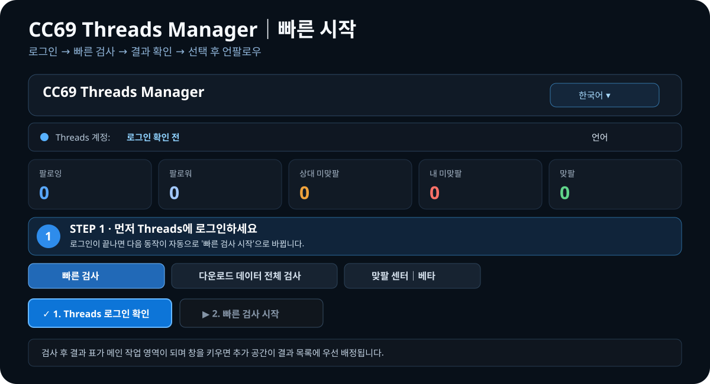

<p align="center"><a href="README.md">繁體中文</a> ｜ <a href="README.en.md">English</a> ｜ <a href="README.ja.md">日本語</a> ｜ <strong>한국어</strong></p>

<h2 align="center">CC69 Threads Manager</h2>
<p align="center">Threads 팔로우 관계를 더 명확하게 정리하는 Windows 데스크톱 앱.</p>

<p align="center"><a href="https://github.com/R69T/CC69_Threads_Public/releases/latest"><strong>⬇️ 최신 버전 다운로드</strong></a> · <a href="#-빠른-시작"><strong>🚀 빠른 시작</strong></a> · <a href="#-windows-smartscreen"><strong>🛡️ SmartScreen</strong></a></p>

<p align="center"></p>

## 🚀 빠른 시작

| 단계 | 해야 할 일 | 표시되는 내용 |
| --- | --- | --- |
| **1. CC69 실행** | ZIP 압축을 풀고 `CC69_Threads_Manager.exe` 실행 | 첫 실행에서 브라우저/로컬 데이터를 준비합니다. |
| **2. Threads 로그인 확인** | 파란색 로그인 버튼 클릭 | Threads / Meta 공식 페이지에서 로그인합니다. |
| **3. 빠른 검사 시작** | 로그인 후 초록색 검사 버튼이 다음 주요 동작이 됩니다 | Followers / Following 수집 진행률을 표시합니다. |
| **4. 결과 확인** | 상단 5개 통계 카드와 아래 목록 확인 | 팔로잉, 팔로워, 상대 미맞팔, 내 미맞팔, 맞팔. |
| **5. 계정 정리** | 확인된 계정을 선택한 뒤 필요하면 언팔로우 | CC69가 순차 처리하며 진행률을 표시합니다. |

**처음에는 '로그인 → 검사' 순서만 기억하면 됩니다.**

## ✨ 주요 기능

- 🔎 Followers / Following 빠른 검사
- 🟠 나를 맞팔하지 않은 계정 찾기
- 🔴 내가 아직 맞팔하지 않은 계정 찾기
- 🟢 맞팔 상태 표시
- ✅ 선택 계정 순차 언팔로우 + 진행률
- 🕒 신규 팔로우 보호
- 📦 Meta / Threads 공식 다운로드 데이터 가져오기
- 🤝 맞팔 센터 Beta
- 🌐 繁體中文 / English / 日本語 / 한국어

빠른 검사는 **최근 24시간 기준 최대 6회**입니다.

## 🌐 언어

첫 실행 시 Windows 시스템 언어를 기준으로 자동 선택합니다.

- 중국어 Windows → 繁體中文
- 일본어 Windows → 日本語
- 한국어 Windows → 한국어
- 그 외 → English

앱 상단에서 언제든지 변경할 수 있습니다.

## ⬇️ 다운로드 및 설치

**https://github.com/R69T/CC69_Threads_Public/releases/latest** 에서

`CC69_Threads_Manager_vX.X.X_Windows.zip`

을 다운로드하고 압축을 푼 뒤 `CC69_Threads_Manager.exe`를 실행하세요.

## 🛡️ Windows SmartScreen

CC69는 현재 상용 Windows 코드 서명 인증서로 서명되지 않았기 때문에 “Windows에서 PC를 보호했습니다”, “알 수 없는 게시자” 등의 메시지가 표시될 수 있습니다.

**이 경고 자체가 바이러스가 탐지되었다는 의미는 아닙니다.** Windows가 현재 EXE 게시자 서명/평판을 확인할 수 없다는 뜻입니다.

공식 Releases에서만 다운로드하세요:

**https://github.com/R69T/CC69_Threads_Public/releases**

필요하면 PowerShell에서 SHA-256을 확인할 수 있습니다.

```powershell
Get-FileHash .\CC69_Threads_Manager.exe -Algorithm SHA256
```

ZIP 안의 `CC69_Threads_Manager.exe.sha256`과 비교하세요.

## 🔐 로그인 및 개인정보

Threads / Meta 비밀번호는 **공식 로그인 페이지**에서 입력합니다. CC69 자체 화면에 비밀번호를 입력하는 방식이 아닙니다.

## 🔎 빠른 검사가 불완전한 경우

Threads Web은 동적 로딩과 가상 목록을 사용합니다. CC69는 `가져온 수 / Threads 표시 수`를 보여줍니다.

불완전하면 **다운로드 데이터 전체 검사**로 전환하고 Meta / Threads 공식 다운로드 관계 데이터를 가져오세요.

## 🤝 맞팔 센터 Beta

참여는 선택 사항입니다. 참여 계정 간 매칭과 최소한의 페어 상태를 관리합니다. 현재 베타 기능입니다.

## ⚠️ 사용 안내

Threads의 Web 구조와 플랫폼 제한은 변경될 수 있습니다. 인증, 제한, '나중에 다시 시도' 메시지가 나타나면 작업을 중지하고 나중에 다시 시도하세요.