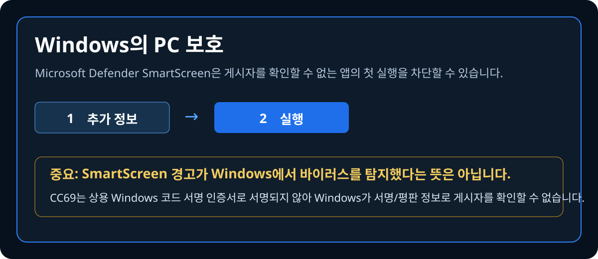

<p align="center"><a href="README.md">繁體中文</a> ｜ <a href="README.en.md">English</a> ｜ <a href="README.ja.md">日本語</a> ｜ <strong>한국어</strong></p>

<h2 align="center">CC69 Threads Manager</h2>
<p align="center"><strong>Threads 팔로우 관계를 한눈에 정리하세요.</strong></p>

<p align="center">
  <a href="https://github.com/R69T/CC69_Threads_Public/releases/latest"><strong>⬇️ 최신 버전 다운로드</strong></a>
  &nbsp; · &nbsp;
  <a href="#-빠른-시작"><strong>🚀 빠른 시작</strong></a>
  &nbsp; · &nbsp;
  <a href="#%EF%B8%8F-windows-smartscreen"><strong>🛡️ Windows 안전 안내</strong></a>
</p>

## ✨ CC69 기능 소개

<p align="center"></p>

> **맞팔하기로 했는데 팔로잉 수와 팔로워 수 차이가 너무 큰가요?** CC69가 Threads 팔로우 관계를 빠르게 비교해 맞팔하지 않은 계정을 찾고 더 쉽게 정리할 수 있게 도와줍니다.

## 🎯 CC69가 하는 일

서로 맞팔하기로 했는데 시간이 지나면서 Following이 Followers보다 훨씬 많아졌다면, CC69로 먼저 관계를 정리할 수 있습니다.

- 🟠 내가 팔로우하지만 상대가 나를 맞팔하지 않은 계정
- 🔴 상대는 나를 팔로우하지만 내가 아직 맞팔하지 않은 계정
- 🟢 맞팔 상태
- ✅ 확인된 계정을 선택한 뒤 진행률을 보면서 순차 언팔로우
- 🕒 신규 팔로우 보호: 기본 0일, 사용자가 직접 조정 가능
- 📦 빠른 검사가 불완전하면 Meta / Threads 공식 다운로드 데이터 가져오기
- 🌐 繁體中文 / English / 日本語 / 한국어

### 🙂 무료 작은 보너스

**맞팔 센터｜무료 작은 보너스**

모두를 위한 무료 작은 기능입니다. 궁금하시면 직접 둘러보세요. 즐거운 맞팔 되세요 🙂

## 🚀 빠른 시작

**로그인 → 빠른 검사 → 결과 확인 → 선택 후 정리**

빠른 검사는 **최근 24시간 기준 최대 6회**입니다.

## ⬇️ 다운로드 및 설치

**https://github.com/R69T/CC69_Threads_Public/releases/latest** 에서 `CC69_Threads_Manager_vX.X.X_Windows.zip`을 다운로드하고 압축을 푼 뒤 `CC69_Threads_Manager.exe`를 실행하세요.

## 🛡️ Windows SmartScreen

<p align="center"></p>

CC69는 현재 **상용 Windows 코드 서명 인증서로 서명되지 않았습니다**. 따라서 처음 실행할 때 “Windows의 PC 보호” 또는 “알 수 없는 게시자” 메시지가 표시될 수 있습니다.

> **이 SmartScreen 화면 자체는 Windows가 바이러스를 탐지했다는 뜻이 아닙니다.** Windows가 신뢰할 수 있는 디지털 서명 / 기존 게시자 평판으로 CC69의 게시자를 확인할 수 없다는 뜻입니다.

이 프로젝트의 공식 GitHub Releases에서 다운로드했다면:

1. **추가 정보**를 클릭합니다.
2. 앱 이름이 `CC69_Threads_Manager.exe`인지 확인합니다.
3. **실행**을 클릭합니다.

반드시 공식 Releases에서만 다운로드하세요. 필요하면 SHA-256으로 파일을 확인할 수 있습니다.

```powershell
Get-FileHash .\CC69_Threads_Manager.exe -Algorithm SHA256
```

Release 패키지의 `CC69_Threads_Manager.exe.sha256` 값과 비교하세요.

> Windows Defender 또는 다른 백신이 SmartScreen과 별도로 구체적인 악성코드 탐지를 표시한다면 별개의 경고입니다. 무시하지 말고 확인하세요.

## 🔐 로그인 및 개인정보

Threads / Meta 비밀번호는 공식 로그인 페이지에서 입력합니다. CC69 자체 화면에 비밀번호를 입력하는 방식이 아닙니다.

## 🔎 빠른 검사가 불완전한 경우

Threads Web은 동적 로딩과 가상 목록을 사용합니다. 불완전하면 **전체 데이터 검사**로 전환하고 Meta / Threads 공식 다운로드 관계 데이터를 가져오세요.

## ⏳ 언팔로우 처리 시간

CC69는 계정을 하나씩 열고 확인하기 때문에 선택한 계정이 많을수록 시간이 오래 걸립니다. 시작 후 진행률을 확인하며 기다려 주세요.

## ⚠️ 사용 안내

Threads에서 인증, 제한, '나중에 다시 시도' 메시지가 나타나면 작업을 중지하고 나중에 다시 시도하세요.
