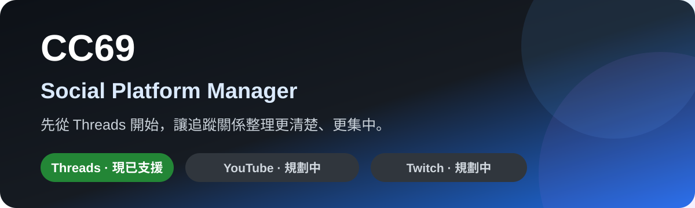

  

  <strong>CC69 是一套 Windows 社群平台管理工具。</strong> 
  目前第一階段專注支援 <strong>Threads</strong>，未來將逐步擴充至 <strong>YouTube</strong>、<strong>Twitch</strong> 與其他社群平台。

  
  
  
  

---

# CC69 現在可以做什麼？

如果你平常有在經營 Threads，追蹤人數一多，很容易遇到這些問題：

- 我追蹤了哪些人，但對方沒有回追？
- 哪些帳號是最近才追蹤，不想太快取消？
- Followers / Following 名單很多，人工一個一個整理太麻煩。
- 想參加互追，但又不想一直重複遇到同一批帳號。

**CC69 的目的，就是把這些常見整理工作集中到一個 Windows 桌面程式裡。**

> **目前版本只正式支援 Threads。**  
> YouTube、Twitch 等平台屬於後續開發方向，現在尚未提供相關功能。

---

# Threads 主要功能

| 功能 | 用途 |
| --- | --- |
| **快速檢查** | 直接取得目前可讀取的 Followers / Following 關係，快速整理互追狀態。 |
| **官方完整檢查** | 匯入 Meta 官方下載的 Threads 資料，進行較完整的關係比對。 |
| **沒回追整理** | 找出「我有追蹤、對方沒有回追」的帳號，選擇後依序取消追蹤。 |
| **新追蹤保護** | 設定保護天數，避免剛追蹤不久的帳號太快被整理掉。 |
| **互追中心** | 自願加入互追配對，取得尚未配過的帳號並逐一完成追蹤。 |
| **登入狀態保存** | 第一次登入並儲存登入資訊後，之後通常不必每次重新輸入帳號密碼。 |
| **本機資料保存** | 關係整理與操作狀態主要保存在使用者自己的電腦。 |

---

# 下載與安裝

## 最簡單的方式

前往本專案的 **Releases**，下載最新的 Windows ZIP：

`CC69_Threads_Manager_vX.X.X_Windows.zip`

解壓縮後執行：

`CC69_Threads_Manager.exe`

ZIP 內同時附有：

- `CC69_Threads_Manager.exe`
- EXE 的 SHA-256 核對檔
- `README.txt` 簡短使用說明

Release 頁面另外提供 ZIP 本身的 SHA-256 核對檔。

> **一般使用者只需要下載 ZIP 即可。**

---

# 第一次使用

1. 解壓縮下載的 ZIP。
2. 執行 `CC69_Threads_Manager.exe`。
3. 到「快速檢查」開啟 Threads 登入流程。
4. 登入會在 Threads / Meta 官方頁面中完成。
5. 若畫面出現「儲存登入資訊」，建議完成儲存。
6. 完成後即可開始使用 Threads 關係整理功能。

**CC69 本身不會要求你把 Threads / Meta 密碼輸入到 CC69 介面。**

---

# 快速檢查 vs 官方完整檢查

### 快速檢查

適合平常快速查看目前 Threads 網頁能提供的關係資料。

但 Threads 網頁介面與平台限制可能變更，因此快速檢查取得的資料有可能不完整。

### 官方完整檢查

如果你希望做較完整的 Followers / Following 比對，可以下載自己的 Meta 官方 Threads 資料，再匯入 CC69。

這也是在快速檢查資料不完整時，比較推薦的方式。

---

# 互追中心

互追中心的概念是：**有意願互追的使用者自願加入配對。**

CC69 會協助取得尚未配對過的帳號，並依序完成追蹤流程；同一組帳號不會一直重複配對。

這項功能的目標不是大量亂追，而是讓願意互追的使用者有一個比較容易整理的配對方式。

---

# 開發路線

CC69 的方向不只是一個 Threads 工具，而是逐步發展成一套 **Social Platform Manager**。

| 平台 | 狀態 | 方向 |
| --- | --- | --- |
| **Threads** | ✅ 目前支援 | 關係整理、沒回追、官方資料比對、互追中心等。 |
| **YouTube** | 🛠️ 規劃中 | 頻道、影片、素材與日常管理相關功能。 |
| **Twitch** | 🛠️ 規劃中 | 頻道與實況工作流程相關管理功能。 |
| **其他平台** | 💡 評估中 | 依實際需求逐步擴充。 |

功能會逐步增加，但每一個平台都會以「真正能減少重複操作」為優先，而不是單純把功能堆在一起。

---

# 使用提醒

Threads 的網頁結構、平台規則與限制可能隨時調整，因此部分功能可能需要跟著平台更新。

所有追蹤與取消追蹤操作都應由使用者主動確認後執行。如果 Threads 顯示驗證、暫時限制、稍後再試或其他限制訊息，請停止操作並稍後再使用。

---

  <strong>CC69 Social Platform Manager</strong> 
  Threads first. More platforms coming later.

