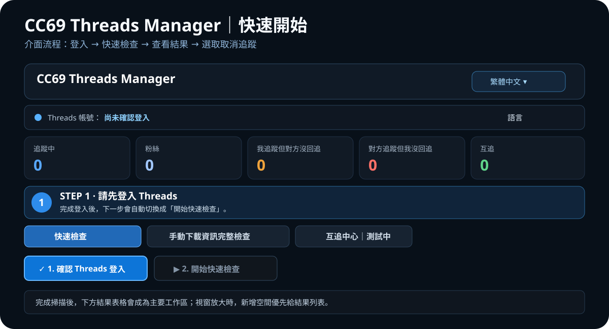

<p align="center"></p>

<p align="center"><strong>繁體中文</strong> ｜ <a href="README.en.md">English</a> ｜ <a href="README.ja.md">日本語</a> ｜ <a href="README.ko.md">한국어</a></p>

<h2 align="center">CC69 Threads Manager</h2>
<p align="center">Windows 上更清楚地整理 Threads 的 Following / Followers 關係。</p>

<p align="center">
  <a href="https://github.com/R69T/CC69_Threads_Public/releases/latest"><strong>⬇️ 下載最新版</strong></a>
  &nbsp; · &nbsp;
  <a href="#-快速開始"><strong>🚀 快速開始</strong></a>
  &nbsp; · &nbsp;
  <a href="#-windows-smartscreen"><strong>🛡️ Windows 安全提示</strong></a>
</p>

<p align="center">
  
  
  
</p>

---

## 👀 先看介面與操作流程

<p align="center"></p>

> 圖中介面結構依照目前 CC69 實際 Dashboard 設計：帳號工具列、五張統計卡、STEP 引導、三個功能分頁、登入／快速檢查與下方結果列表。

---

## 🚀 快速開始

| 步驟 | 要做什麼 | 你會看到什麼 |
| --- | --- | --- |
| **1. 啟動 CC69** | 解壓縮 ZIP 後執行 `CC69_Threads_Manager.exe` | 首次啟動會建立必要的瀏覽器與本機資料。 |
| **2. 確認 Threads 登入** | 按藍色的「確認 Threads 登入」 | 在 Threads / Meta 官方頁面完成登入。 |
| **3. 開始快速檢查** | 登入成功後，綠色「開始快速檢查」會成為下一步主按鈕 | 進度條會顯示 Followers / Following 已取得數量。 |
| **4. 查看結果** | 看上方統計卡與下方表格 | 追蹤中、粉絲、沒回追、我沒回追、互追。 |
| **5. 整理帳號** | 勾選確認過的帳號，再執行取消追蹤 | CC69 會逐一處理並顯示進度。 |

### 第一次使用最重要的一件事

**先登入，再掃描。**

未登入時，CC69 會把登入按鈕設成最醒目的主操作；登入完成後，視覺焦點會切換到「開始快速檢查」。

---

## ✨ 主要功能

- 🔎 **快速檢查**：直接透過 Threads Web 讀取可取得的 Followers / Following。
- 🟠 **沒回追我**：找出「我有追蹤，但對方沒有追蹤我」。
- 🔴 **我沒回追**：找出「對方追蹤我，但我尚未追蹤對方」。
- 🟢 **互追**：清楚顯示雙向追蹤。
- ✅ **依序取消追蹤**：勾選後逐一處理並顯示進度。
- 🕒 **新追蹤保護**：避免剛追蹤的帳號太快被整理。
- 📦 **完整資料匯入**：快速掃描不完整時，可匯入 Meta / Threads 官方下載資料。
- 🤝 **互追中心 Beta**：自願加入互追配對。
- 🌐 **四語系**：繁體中文 / English / 日本語 / 한국어。

快速檢查目前限制為 **滾動 24 小時最多 6 次**。

---

## 🌐 語言

第一次啟動時會依照 Windows 系統語言自動選擇：

- 中文 Windows → **繁體中文**
- 日文 Windows → **日本語**
- 韓文 Windows → **한국어**
- 其他 → **English**

程式最上方可隨時切換，CC69 會記住你的選擇。

---

## ⬇️ 下載與安裝

前往：**https://github.com/R69T/CC69_Threads_Public/releases/latest**

下載：

`CC69_Threads_Manager_vX.X.X_Windows.zip`

解壓縮後執行：

`CC69_Threads_Manager.exe`

Release 會附 SHA-256 檔，可用來核對下載內容。

---

## 🛡️ Windows SmartScreen

CC69 目前**尚未使用商業 Windows Code Signing 憑證**簽署 EXE，所以 Windows 可能顯示：

- 「Windows 已保護您的電腦」
- 「未知的發行者」
- SmartScreen 執行確認

**這個提示本身不代表 Windows 已偵測到病毒。** 它代表 Windows 目前無法驗證這個 EXE 的發行者簽章／聲譽。

請只從本 GitHub 官方 Releases 下載：

**https://github.com/R69T/CC69_Threads_Public/releases**

### SHA-256 驗證

```powershell
Get-FileHash .\CC69_Threads_Manager.exe -Algorithm SHA256
```

將結果與 ZIP 內的 `CC69_Threads_Manager.exe.sha256` 比對。

---

## 🔐 登入與隱私

Threads / Meta 帳號密碼是在**官方登入頁面**輸入，不是在 CC69 自己的介面輸入。

第一次登入後如果 Threads 出現「儲存你的登入資料？」流程，CC69 會嘗試完成「儲存資料」，讓之後通常不需要每次重新登入。

---

## 🔎 快速檢查不完整怎麼辦？

Threads Web 使用動態載入與虛擬清單。CC69 會顯示：

`已取得數量 / Threads 顯示總數`

如果快速檢查仍不完整，請切換到：

**手動下載資訊完整檢查**

再匯入 Meta / Threads 官方提供的下載資料。這是需要更完整關係比對時的推薦方式。

---

## 🤝 互追中心 Beta

互追中心採自願加入。加入後 CC69 會協助取得尚未配對過的其他參與帳號，並保留基本配對狀態。此功能仍在測試中。

---

## ⚠️ 使用提醒

Threads 的頁面結構與平台限制可能隨時更新。若 Threads 顯示驗證、限制、稍後再試或其他異常，請停止操作並稍後再使用。

CC69 不保證任何操作頻率一定不會觸發平台限制。

---

<p align="center"><strong>CC69 Threads Manager</strong><br>Threads first. More platforms later.</p>